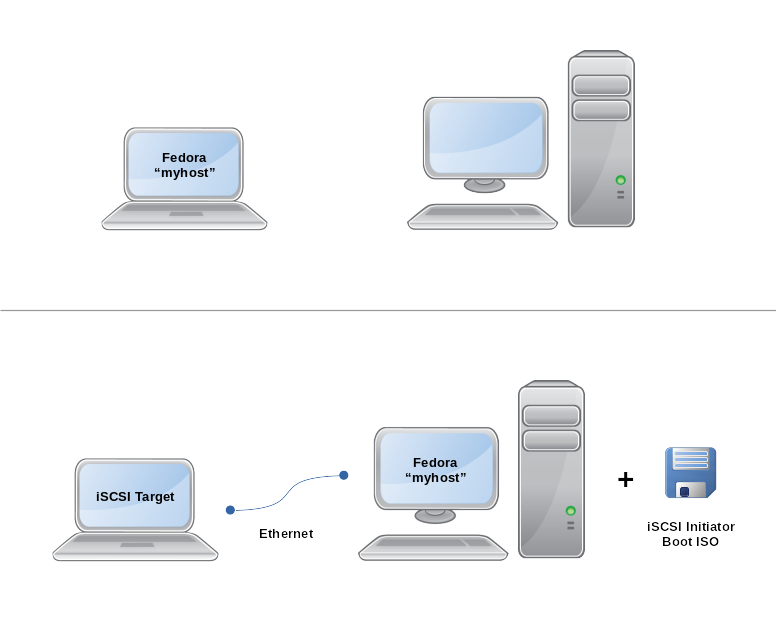

# dracut-iscsi-target

*!! Beta software - may prevent your computer from booting.*

*!! Currently there is NO ENCRYPTION for the iSCSI endpoint. See TODO
below. For now, only run this on a trusted network with trusted hosts.*


## Overview

This Dracut module enables the Fedora initramfs to start as an iSCSI
Target instead of doing a regular boot. This allows you to boot the OS
of one host on another connected via Ethernet using `netroot=iscsi:...`.

For example, you can run your laptop OS on your more powerful desktop
while still having access to all your laptop's files and programs.





## Supported Operating Systems

- Fedora 32+

There are no plans at this time to support other operating systems,
but if they have good Dracut support and would not require too many
conditional branches in the code here then they could potentially be
added.


## Packages

- RPM: <a href="https://copr.fedorainfracloud.org/coprs/jwmullally/dracut-iscsi-target/package/dracut-iscsi-target/">Fedora COPR</a>

    ```
    dnf copr enable jwmullally/dracut-iscsi-target
    dnf install dracut-iscsi-target
    ```


## Usage

- Install the package.

- Edit `/etc/dracut.conf.d/iscsi-target.conf`. The items you will want
  to modify first are:

  - `rd.iscsi_target.dev=<your target block devices>`
  - `ifname=bootnet0:<your NIC MAC addresses>`
  - `root=<your root block devices UUID>`

  When specifying block devices, it is recommended that you use an entry
  from one of `/dev/disk/by-{id,label,uuid}` instead of the enumerated
  `/dev/sd*` nodes, as those can change order depending on what devices
  are connected or how they are connected.

- Run this command to regenerate the initramfs image for the running
  kernel and to add the extra `iSCSI Target` boot entry. This should only
  be needed once, as this will automatically run every time a new kernel
  version is installed. In case this makes your computer unbootable,
  make sure you have at least one older kernel available as a fallback
  or make a backup bootdisk.

    ```
    kernel-install --verbose add $(uname -r) /lib/modules/$(uname -r)/vmlinuz
    ```

  This also creates `/var/lib/dracut/iscsi-target/iscsi-boot-$(uname -r).iso`.
  The ISO contains a copy of the kernel and initramfs, along with the
  necessary initrd cmdline arguments to do an iSCSI boot to the target.

- Burn the ISO to a CD, or copy to a USB key like so:

    ```
    dd if=/var/lib/dracut/iscsi-target/iscsi-boot-$(uname -r).iso of=/dev/disk/by-id/usb-Kingston_DataTraveler_II+_ABCDE01234-0\:0
    ```

  If you want this step to be done automatically every time a new kernel
  is installed, add the destination block device to 
  `dracut_iscsi_target_iso_auto_write_devices`.

- Reboot the host and select the `iSCSI Target` entry. After the target
  is configured, this will stop the regular boot sequence and drop to an
  emergency shell. Use `journalctl` and check for lines beginning with
  `iscsi-target:` to ensure everything is setup correctly.

- Boot the client/initiator host using the CD or USB key.

- After the initrd configures the network and iSCSI initiator, the
  target's exported block devices will be available on the initiator host,
  and the the target's OS should begin booting as normal.


## FAQ

### Why use Dracut for the iSCSI target?

Dracut already supports booting as an iSCSI Initiator as a main
feature. To serve the OS disk as an iSCSI target requires running
a small Linux OS from memory, with access to the disks and network
interface. Since Dracut is all about building initrd images with disk
and network support, it is ideally suited for this use case. In this
situation, instead of doing a regular boot, we simply start the iSCSI
target and halt the regular boot process. An added bonus is that we can
use the same up-to-date kernel and initrd for both initiator and target,
even when the kernel is updated.


### How can I use bootnet0 as a regular network interface?

By default, the IP configuration for the target and initiator is a
private point-to-point link. If the network interface you are using for
the iSCSI connection is also the one you want to use as a regular Ethernet
network connection, you can add DHCP to this interface with the following:

    rm -f /etc/sysconfig/network-scripts/ifcfg-bootnet0
    nmcli con reload
    nmcli con mod bootnet0 ipv4.method auto
    nmcli con up bootnet0

Be careful not to bring down the `bootnet0` interface, as this will
prevent the iSCSI connection from working and will crash the OS. This is
equivilant to unplugging the harddrive from a running system.


### Do kernel upgrades work if I am running under the initiator?

Kernel upgrades appear to run without issue, but I have only tested
this a handful of times. This was made easier with the introduction of
[BootLoaderSpec by default](https://fedoraproject.org/wiki/Changes/BootLoaderSpecByDefault).
The only requirement is that the `/var/lib/dracut/iscsi-target/iscsi-boot-$(uname -r).iso`
file with the latest kernel will need to be re-written to your boot USB
or CD everytime this happens. This can be done automatically by setting
`dracut_iscsi_target_iso_auto_write_devices` as described above.

If you don't update the initator boot image, eventually the version
of the kernel your using to boot will be removed from the system during
regular updates (e.g. if 5 newer kernels are installed). When this happens
the `/lib/modules/$(uname -r)` folder for that kernel will be missing,
and it will not be possible to load any kernel modules not already stored
in the initrd from the old ISO.


### Why is dracut hostonly disabled by default?

Dracut by default sets `hostonly=yes`, which causes the generated initrd
images to only contain the kernel modules necessary to boot the current
system. This keeps the initrd sizes small, which is important when `/boot`
is a small seperate partition and around 5 previous kernels are installed.

While using this package and potentially installing new kernels
when running under either the iSCSI initiator and original host,
different kernel modules would end up in the initrd depending on which
host the image was updated. Setting `hostonly=no` means the same modules
will be included no matter which host it is generated on, and keeps the
initrd image consistent and predictable, at the cost of extra space.

If you want to set `hostonly=yes`, you'll probably want to also define all
necessary modules for both hosts with `add_drivers+="..."`.


## Troubleshooting

Due to network startup delays, the iSCSI initiator might need two
connection attempts to succeed.

You will need the kernel module for the NIC of the client/initiator
host to be in the initramfs image. Either modify the `add_drivers`
line, or set `hostonly=no` to include all modules. See `dracut.conf(5)`
for more information.

If the dracut boot sequence fails, you can debug it by appending
`rd.shell` to the cmdline to drop to a shell on error, or use
`rd.debug` to enable verbose shell command tracing, or
`rd.break=...` to set a breakpoint. Remove `rhgb` and `quiet`
to see kernel and system messages. See `dracut.cmdline(7)` for 
more information.


## TODO

- [MACSEC L2 encryption](https://developers.redhat.com/blog/2016/10/14/macsec-a-different-solution-to-encrypt-network-traffic/)
- Make initiator add devices in LUN order
  - (wireshark suggests they are being added in order reported by target)
- Remove need for specifying `$dracut_iscsi_target_boot_prefix`
- Sort "iSCSI Target" entry under Fedora entries in bootloader menu
- Add UEFI boot to the generated ISO
- Better integrate with dracut+systemd for network, device settling and 
  service target override.
- Move `iscsi-target.conf` paramater descriptions in this README to the
  file itself.


## Developing

Patches are welcome.

- Test with the sample VMs in [test](./test) before opening a pull 
  request.
- Stick to basic POSIX shell where possible. Minimize shellcheck errors.


### LIO Target ConfigFS

As most LIO Target documentation uses `targetcli`, you can use `strace`
to see what it writes to the ConfigFS at `/sys/kernel/config/target/`:

    targetcli clearconfig confirm=True
    tcli() { strace -e trace=symlink,mkdir,open,openat,write -s 4096 targetcli $1 2>&1 | grep -A9999 run_cmdline ; }
    tcli 'backstores/block create root0 /dev/vdb'
    tcli 'iscsi/ create iqn.2009-02.com.example:for.all'
    tcli 'iscsi/iqn.2009-02.com.example:for.all/tpg1 set attribute authentication=0 demo_mode_write_protect=0 generate_node_acls=1'
    tcli 'iscsi/iqn.2009-02.com.example:for.all/tpg1/luns create /backstores/block/root0 1'
    tcli 'iscsi/iqn.2009-02.com.example:for.all/tpg1/acls create iqn.2009-02.com.initiator:for.all'


## Reference

- [LIO - The Linux SCSI Target Wiki](http://linux-iscsi.org/wiki/ISCSI)
- [dracut.conf(5)](http://man7.org/linux/man-pages/man5/dracut.conf.5.html)
- [dracut.cmdline(7)](http://man7.org/linux/man-pages/man7/dracut.cmdline.7.html)
- [dracut modules](https://github.com/dracutdevs/dracut/blob/master/README.modules)
- [systemd-boot](https://www.freedesktop.org/wiki/Software/systemd/systemd-boot/)


## Author

Copyright (C) 2018 Joseph Mullally

License: [MIT](./LICENCE.txt)

Project: <https://github.com/jwmullally/dracut-iscsi-target>
